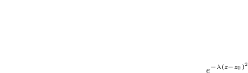
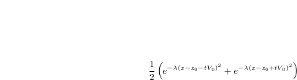

# Explicit PDE engine for wave propagation

## Summary
This code solves the acoustic wave equation for heterogeneous
media (e.g. variable characteristic wave speed):

on a cartesian grid, using a classical
second order centered finite differences in time and space.

It is open source (Apache 2 license).

## Features

* flexible input: in the parameter file, you can input initial conditions and
  characteristic velocity using either binary files or mathematic formulas,
  without modifying the code.
* flexible variables output: you can output the grid variables either
  in VTK or simple gridded binary and ascii format. The VTK files can be
  opened in [paraview](http://www.paraview.org) or any visualisation
  software supporting the VTK file formats. The gridded binary and ascii
  format can -- for example -- be read and processed using python. You will
  find two python scripts (`plot_output.py` and `read_receivers.py`) in the directory.
* periodical boundary conditions. Optionally, the user can specify
  imperfect absorbing boundary conditions using the sponge layer technique (Cerjean et al 1985).

## Install, build and execution

### Dependencies

The code is written in C/C++, and has a few optional python scripts
for post-processing results. It depends on [plog](https://github.com/SergiusTheBest/plog) for logging,
[muparser](http://beltoforion.de/article.php?a=muparser)
for parsing mathematical formulas, and [picojson](https://github.com/kazuho/picojson) (for parsing the
JSON parameter file). However the source of these libraries are bundled
in the git repository, so you don't need to install anything.

### Generating the executable

The main steps are:

* get the source code on your machine

        git clone https://github.com/RaphaelPoncet/2016-macs2-projet-hpc

* go to the source directory

        cd 2016-macs2-projet-hpc

* compile

        make wave.exe

* (optional) if the compilation fails with a message involving the muparser
  library, compile the library by hand:

        cd ./external/muparser-2.2.5/
        ./configure --enable-shared=no
        make
        cd ../../
	make wave.exe

### Execution

The executable is named `wave.exe`. To execute the code, you need to provide a *parameter file*:

    ./wave.exe param_file.json

This file is in [json](http://www.json.org) format. The repository
comes with 3 examples of configuration files:

* `convergence.json` : propagation on a 1D plane wave in a homognenous
  medium. This file demonstrates the simplest way to study the convergence of the numerical scheme.

* `homogeneous.json` : propagation of a gaussian bump in an homogeneous medium.

    

* `marmousi2.json` : propagation of a gaussian bump in the Marmousi 2
  velocity model (an extension of the original Marmousi model)

    

    The above image represent a snapshot of pressure waves propagating
    through the model. Below, we repesent a *shot gather*, e.g. the
    recording of pressure time series on an array of receivers.

    

## How to use the parameter file

### Looking at an example

Let us look in detail at the `convergence.json` parameter file.

    "parameters" : ["x0=0.5*(xmin+xmax)", 
                    "z0=0.5*(zmin+zmax)", 
                    "lambda=100.0", 
                    "V0=0.1"],

The *parameters* field define a few parameters that can be used
subsequently in the remainder of the file.

    "init" : {"velocity" : {"formula" : "V0"},
              "pressure_0" : {"formula" : "exp(-lambda*((z-z0)^2))"},
              "pressure_1" : {"formula" : "pressure_0"}},

The *init* field defines initialization of grid variables. The grid
variables are `pressure_0` and `pressure_1` (the acoustic pressure at
2 successive time steps) , `velocity` (the velocity in the grid, which
is a coefficient of the equation), `laplace_p` (storing the pressure
derivatives) and `pressure_ref` (helpful for storing analytical
formulas). In this case, all variables are defined using mathematical
formulas, but one can also initialize them from a file (see
`marmousi.json` or `marmousi2.json`).

* for the velocity, we define it as a constant, `V0`, which has been
  defined in the `parameters` section.

* the `pressure_0` variable is defined as a 1D gaussian (e.g. a plane
  wave), centered on `z0`, e.g. it will be evaluated as:

* the `pressure_1` variable is defined as equal to `pressure_0`

        "grid" : {"nx" : 20,
                  "ny" : 1,
                  "nz" : 500,
                  "xmin" : 0.0,
                  "xmax" : 10.0,
                  "ymin" : 0.0,
                  "ymax" : 0.0,
                  "zmin" : 0.0,
                  "zmax" : 10.0},

The `grid` section defines the geometry of the computational grid. We
simply define the dimensions of the grid `nx`, `ny` and `nz`, and its
extents in the 3 dimensions `xmin`, `xmax` and so on. *Important*: for
a 2D grid, `ny` *must be set to 1* (e.g. in 2D, the dimensions are x and
z, not x and y).

    "timeloop" : {"dt": ".99*CFL",
                  "tfinal": 20.0},

The `timeloop` section relates to the main loop parameters. First, we
must specify the timestep `dt`. It is the user responsibility to use a
timestep small enough so that the scheme is stable. Fortunately, there
is a special variable, `CFL`, which gives the Courant-Friedrichs-Levy
stability condition. Any number smaller than `CFL` should result in a
stable scheme. Here, we take the timestep to be 99% of the CFL number.
Then, we must specify the maximum simulation time. Alternatively,
*instead of* `tfinal`, one can specify `niter`, the maximum number of
iterations. *Exactly one* of `tfinal`, `niter` must be set.

     "output" : [ {"type" : "EvalVariable", 
                   "rhythm" : 10, 
                   "name": "pressure_ref",
                   "formula" : "0.5*(exp(-lambda*((z-z0-t*V0)^2)) + exp(-lambda*((z-z0+t*V0)^2)))"},
                  {"type" : "CheckVariables",
                   "rhythm" : 200},
                  {"type" : "OutputVariables", 
                   "rhythm" : "end", 
                   "format": "gridded",
                   "file" : "./output/convergence_out_%i.dat"},
                  {"type" : "OutputVariables", 
                   "rhythm" : 100, 
                   "format": "VTK",
                   "file" : "./output/convergence_out_%i.vtr"},
                  {"type" : "OutputNorm",
                   "rhythm" : "end",
                   "name" : "pressure_1 - pressure_ref",
                   "file" : "output/norm.txt"}
                 ]

In that parameter file, the output section is very big, and consists
in 5 different outputs. Let us break it down. First, notice that every
event as a `rhythm`, which is an integer: if it is then, the event
will be executed every 10 timesteps, if it is 100, every 100
timesteps, and so on. Alternatively, instead of an integer, a special
keyword `end` can be used. In that case, the event will execute *only*
at the last iteration.

    {"type" : "EvalVariable", 
     "rhythm" : 10, 
     "name": "pressure_ref",
     "formula" : "0.5*(exp(-lambda*((z-z0-t*V0)^2)) + exp(-lambda*((z-z0+t*V0)^2)))"}

The `EvalVariable` output type applies the mathematical formula
`formula` to the variable `name`. Here, for instance, we apply to
pressure `pressure_ref` the formula

So what we are doing is putting in `pressure_ref` the analytical solution
of the wave equation with our 1D initial data.

    {"type" : "CheckVariables",
     "rhythm" : 200},

The `CheckVariables` event does just compute some internal checks, and
prints the minimum and maximum values of all variables. It can help
detect a problem (variables that blow up for instance).

    {"type" : "OutputVariables", 
     "rhythm" : "end", 
     "format": "gridded",
     "io": "binary",
     "file" : "./output/convergence_out_%i.dat"},
    {"type" : "OutputVariables", 
     "rhythm" : 100, 
     "format": "VTK",
     "file" : "./output/convergence_out_%i.vtr"},

The `OutputVariables` event outputs the grid variables in a file, for
post proessing and visualisation. Currently, `pressure_1`,
`pressure_ref` and `velocity` are written. Two formats are supported:
`VTK` and `gridded`. The VTK format outputs files that can be read
using Paraview. The gridded format is the one that the Python scripts
`read_receiver.py` and `plot_output.py` understand. The gridded format
has two flavors: `binary` and `ascii`. *The python scripts work only
with the* `binary` *flavor*. The `ascii` flavor can be used if you
want to write your own post-processing scripts, since it is very easy
to read.

     {"type" : "OutputNorm",
      "rhythm" : "end",
      "name" : "pressure_1 - pressure_ref",
      "file" : "output/norm.txt"}

Finally, the `OutputNorm` event compute the L1, L2 and L infinity
norms of the `name` expression, and write it on the command line *and*
to the `file` text file. So here, we compute the norm of the
difference between our pressure and the analytical solution. Hence we
are computing the error of the scheme on our grid.
